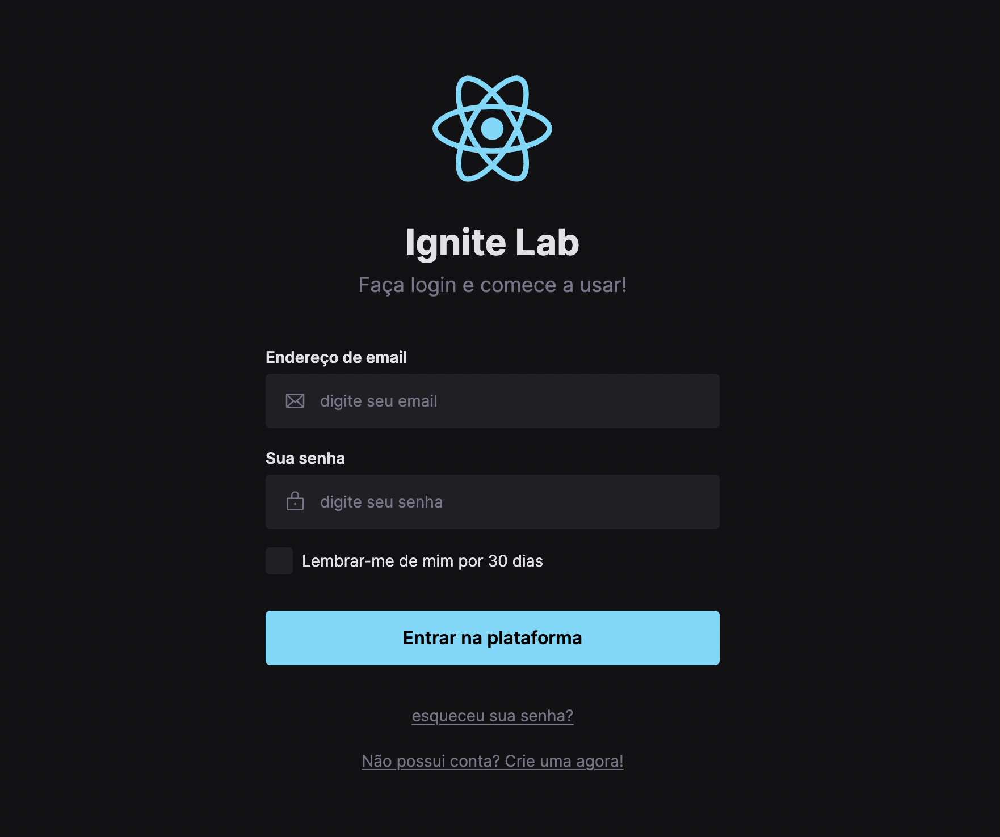

<p align="center">
  
</p>

<p align="center">
  
  
  

  
</p>

<h1 align="center">
</h1>

<br>

## 🧪 Technologies

This project was developed using the following technologies:

- [ReactJS](https://reactjs.org/)
- [TailwindCSS](https://tailwindcss.com/)
- [Figma](https://figma.com)
- [Storybook](https://storybook.js.org/)
- [Vite](https://vitejs.dev/)
- [RadixUI](https://www.radix-ui.com/)

## 🚀 Getting started

Clone the project and access the folder.

```bash
git clone https://github.com/NitoBa/ignite-ds

cd ignite-ds
```

Run this command to install the dependencies

```bash
npm install
```

Run this command to view the interface locally

```bash
npm run dev
```

Run this command to to view the storybook docs

```bash
npm run storybook
```

## 🔖 Layout

You can view the layout through the link below:
- [Figma Layout](https://www.figma.com/file/aeaUjDUbgvZMFfbpKNGE54/Ignite-Lab-Design-System?node-id=0%3A1)

You can view the project through the link below:

- [Live Preview](https://the-movie-app.vercel.app/)

You can view the storybook component docs through the link below:

- [Storybook components docs](https://nitoba.github.io/ignite-ds)

## 📝 License

This project is licensed under the MIT License. See the [LICENSE](LICENSE) file for details.

---

Made with 💜 by [Bruno Alves](https://profile-website-murex.vercel.app/) 👋